# Multimodal-emotion-analysis-system

## 1. 问题背景

### 1.1 基于语音情感分析必要性

随着时代的发展，人际交流的核心：语音是人类交流中最直接和自然的方式之一。情感分析能够帮助我们更好地理解说话者的意图和情绪状态，从而促进更有效的沟通和相互理解。

心理健康诊断：通过分析语音中的情感特征，可以辅助医生或心理专家在诊断抑郁症、焦虑症等心理健康问题时提供有价值的见解。

通过这些应用，我们可以看到，基于语音的情感分析不仅在技术发展上具有挑战性，而且在促进人类社会的情感理解和沟通效率方面具有重要价值。

 

### 1.2 系统项目介绍

本项目旨在建立一个高效的情感分析系统，通过结合文本和语音两种不同的数据输入，来提高情感识别的准确性和效率。系统主要分为文本情感分析和语音情感分析两大部分，各自占据不同的比重，并使用不同的机器学习模型来处理和分析。

 

文本情感分析 (占比30%):

 

模型使用: 采用长短期记忆网络（LSTM）模型来进行文本数据的情感分析。LSTM是一种特别设计来处理序列数据的神经网络，能够捕捉文本中长期依赖的特征，对于理解和分析自然语言非常有效。数据输入: 文本数据可以来源于对话、社交媒体帖子、客户反馈等，经过适当的预处理后输入到LSTM模型中。数据集来源以某电商网站中某个商品的评论作为语料（corpus.csv），点击下载数据集，该数据集一共有4310条评论数据，文本的情感分为两类：“正面”和“反面”，该数据集的前几行如下：

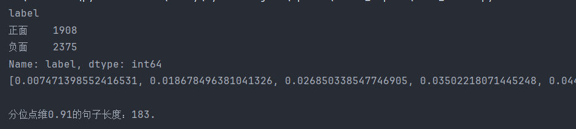

数据集中评论句子长度分布：

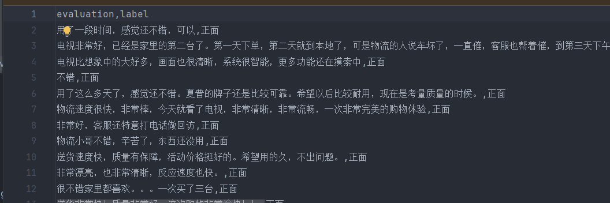

句子长度及出现频数统计图如下：

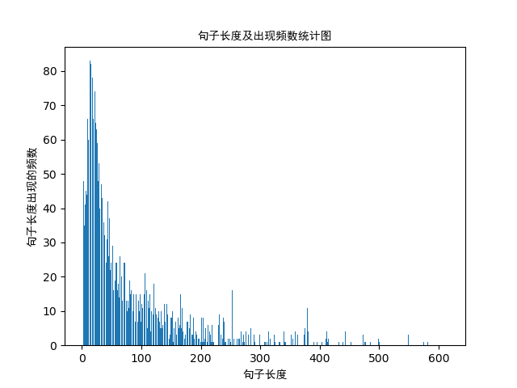

句子长度累积分布函数图如下：

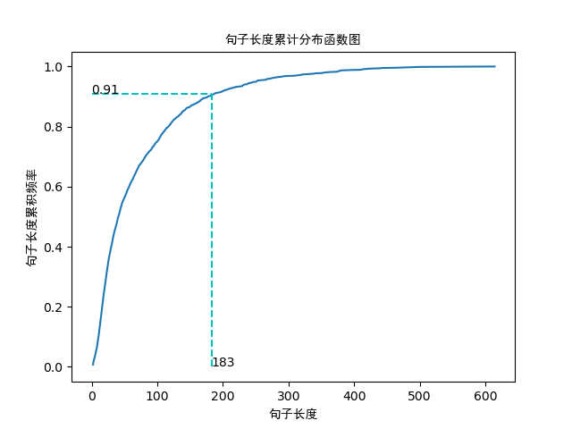

语音情感分析 (占比70%):

模型使用: 采用卷积神经网络（CNN）进行语音数据的情感分析。CNN在处理带有空间层次结构的数据（如图像和声音频谱）时非常有效，能够捕捉到语音信号中复杂的模式和特征。

数据集采用两个：

数据集1：RAVDESS 的这一部分包含 1440 个文件：每个演员 60 次试验 x 24 个演员 = 1440。RAVDESS 包含 24 名专业演员（12 名女性，12 名男性），用中性北美口音说出两个词汇匹配的语句。言语情绪包括平静、快乐、悲伤、愤怒、恐惧、惊讶和厌恶等表情。每个表情都有两个情绪强度级别（正常、强烈），还有一个额外的中性表情。

数据集2： CREMA-D 是一个数据集，包含来自 91 位演员的 7,442 个原始片段。这些片段来自 48 名男演员和 43 名女演员，年龄在 20 岁到 74 岁之间，来自不同的种族和民族（非裔美国人、亚洲人、白种人、西班牙裔和未指定的人种）。演员们从精选的 12 句话中进行发言。这些句子是使用六种不同情绪（愤怒、厌恶、恐惧、快乐、中性和悲伤）之一和四种不同情绪水平（低、中、高和未指定）来呈现的。

数据集中每种情绪图标统计：

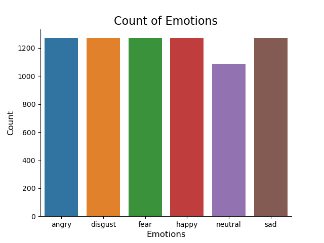

特征提取: 从语音信号中提取以下五个关键特征进行情感分析：

Zero Crossing Rate (过零率)：表示信号符号改变的速度，与语音的频率特性有关。

Chroma STFT (色度频谱变换)：提供音乐和音频中的色度信息，与音调和和谐相关。

MFCC (Mel频率倒谱系数)：在语音识别中广泛使用的特征，捕捉语音的短时功率谱。

RMS Value (均方根值)：衡量音频信号的能量大小。

Spectral Centroid (频谱质心)：表示声音的“亮度”或音频信号频谱的重心。

通过这两种方法的结合，本系统不仅可以理解和分析用户通过文本表达的直接情感，还能通过语音的非言语信息来捕捉更深层次的情绪状态。这种多模态情感分析方法使得系统在各种应用场景下都能提供更为准确和全面的情感理解，例如在客户服务、健康诊断、安全监控等领域的应用。

此外，系统通过加权组合文本和语音分析的结果（文本情感分析占30%，语音情感分析占70%）来综合判断情感，这种组合方式充分考虑了语音在人类交流中传递情感的重要性和直接性，同时保留了文本分析的深度和细致。

本项目通过高效的数据处理、先进的模型应用以及智能的结果融合，致力于建立一个准确、快速和可靠的情感分析系统，以满足不同领域对情感理解和分析的需求。

## 2 采用的技术简介

本设计结合文本和语音情感分析的方法，采用Python环境下的深度学习库进行模型构建与训练。对于文本情感分析，使用长短期记忆网络（LSTM）。LSTM是一种特殊类型的递归神经网络（RNN），适合于长序列数据的学习，能够有效捕获文本中的长距离依赖关系，从而提升模型对文本情绪的理解和预测能力。

### 2.1 文本情感分析

算法流程：

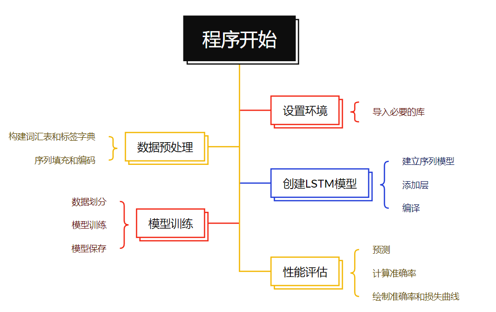

 

文本情感分析部分，我们采用了长短期记忆网络（LSTM）。LSTM是一种特殊的循环神经网络（RNN），特别适用于处理和预测时间序列中间隔和延迟较长的重要事件。LSTM在处理长期依赖问题方面比标准的RNN表现得更好，因为它可以记忆长期的输入。在本研究中，LSTM用于学习文本数据中情感的长期依赖关系，从而提高情感分析的准确性。

 

### 2.2 语音情感分析

算法流程：

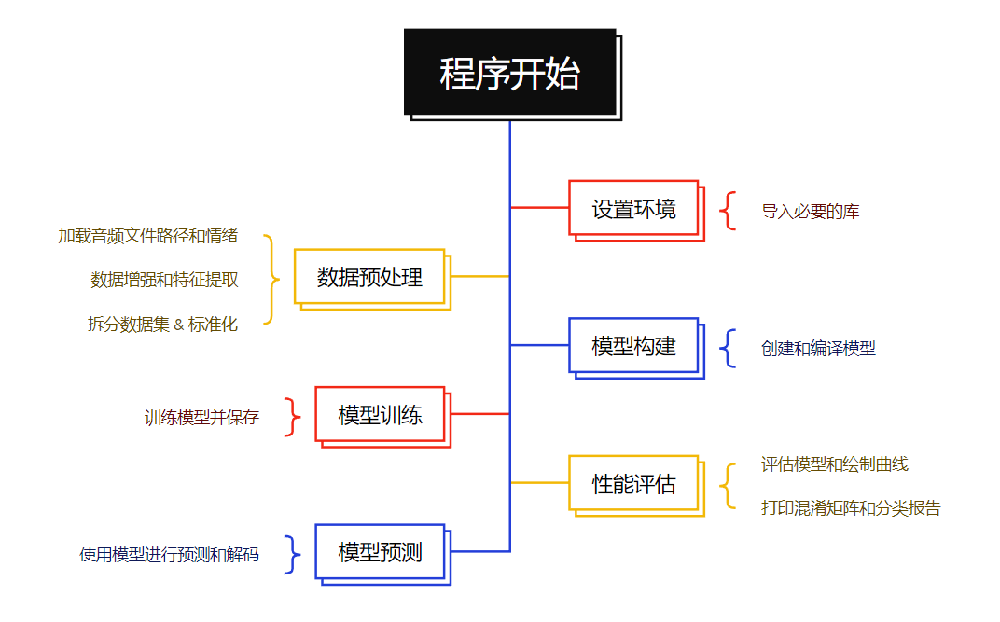

 

语音情感分析部分，我们采用了卷积神经网络（CNN）。CNN是一种深度学习算法，它可以将学习到的权重和特征应用于整个图像，有效地识别图像中的模式和特征。在语音情感分析中，我们利用CNN的特性来提取和学习语音信号的特征，包括以下5个关键特征：

 

1. Zero Crossing Rate (过零率): 过零率是信号符号改变的速率，可以用于区分语音和非语音区域，以及不同类型的发音。

2. Chroma_stft (色度_stft): 色度频率是一种对音频信号进行处理的方式，它关注的是音乐中的12不同音符，有助于识别音乐和语音中的调性内容。

3. MFCC (梅尔频率倒谱系数): MFCC是一种在语音识别中广泛使用的特征，它模拟人类的听觉系统，可以捕捉语音的基本特性。

4. RMS Value (均方根值): 均方根值是信号的平方的平均值的平方根，可以用来衡量信号的能量。

5. Mel Spectrogram: Mel Spectrogram是一种表示语音信号频率分布和时间变化的方式，可以提供丰富的信息用于语音识别。

 2.3 模型训练和评估

在模型训练过程中，我们首先对文本数据进行处理，使用词嵌入将文本转换为数值型的序列。然后，将这些序列输入LSTM模型进行训练。对于语音数据，我们首先提取上述五个特征，然后将它们标准化并输入到CNN模型中进行训练。我们使用的数据集被分为训练集和测试集，模型在训练集上进行训练，在测试集上进行评估，以确定模型的准确性。

可以看到有些过拟合

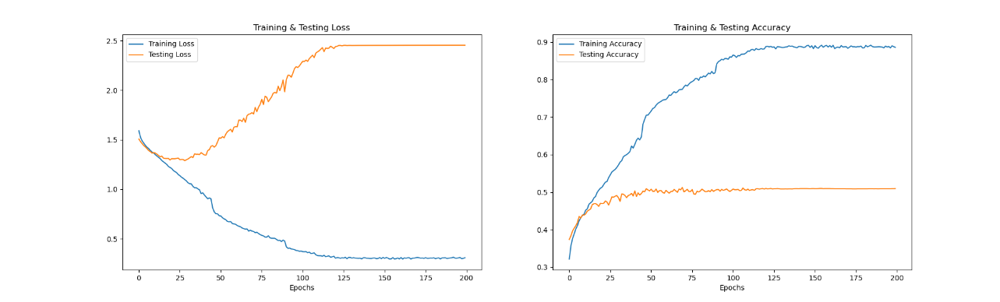

我们采用了准确率作为评估标准，通过比较模型预测的情感标签和实际的情感标签来计算准确率，以此来衡量模型在情感分析任务上的表现。

## 运行截图：

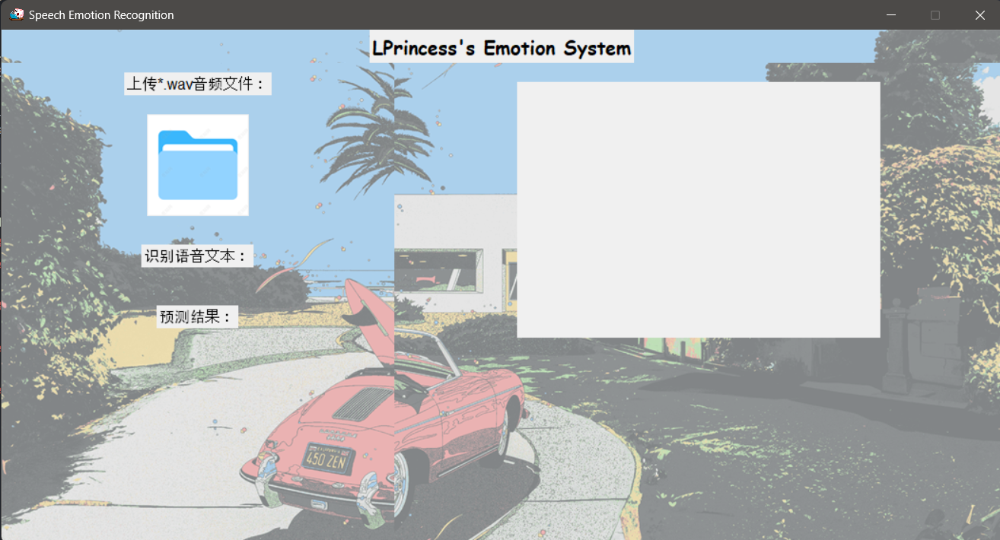

点击上传文件图标：
 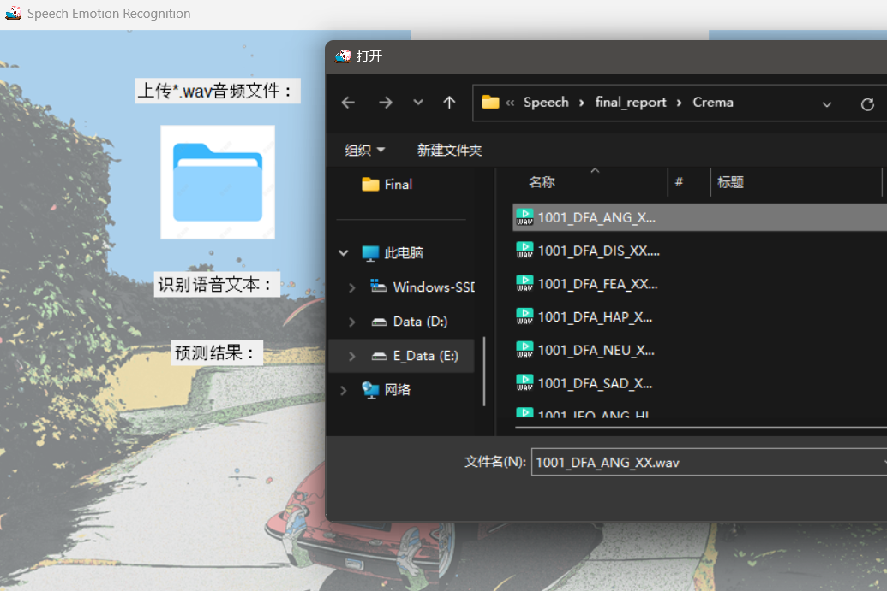

随机选择第一个

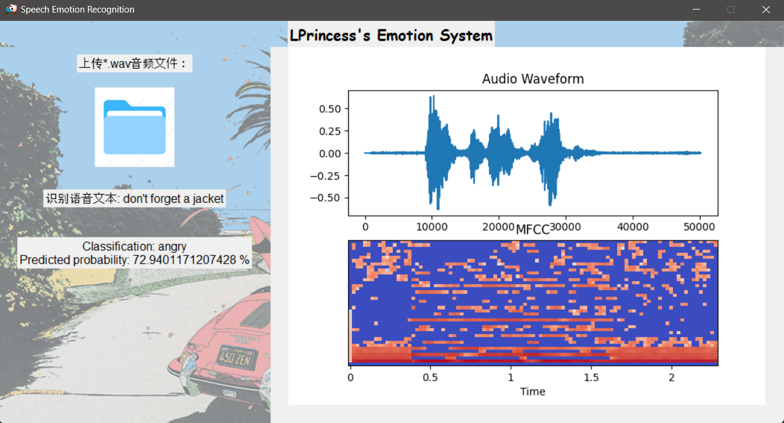

界面显示文本，预测标签以及概率，以及音频图和MFCC特征

